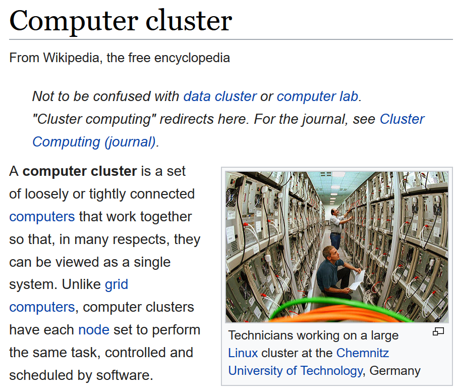
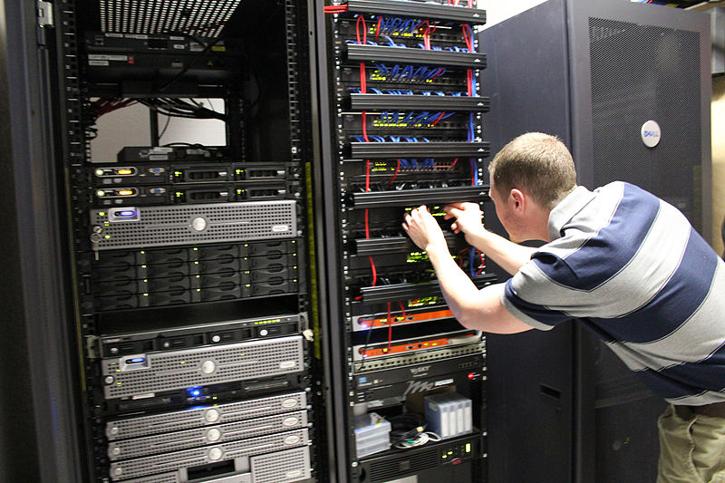
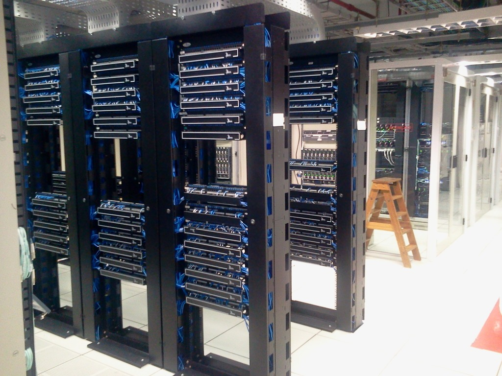
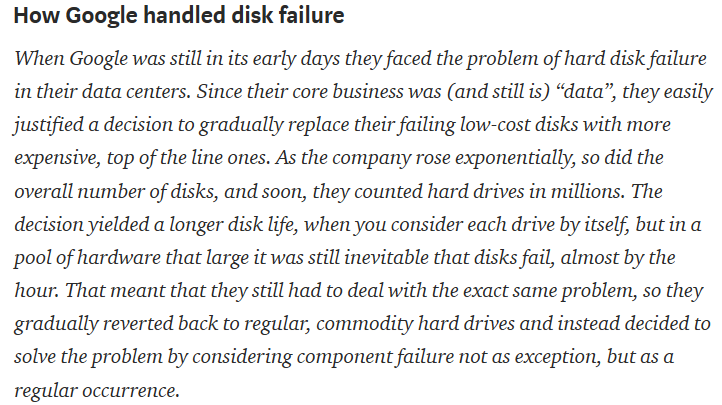
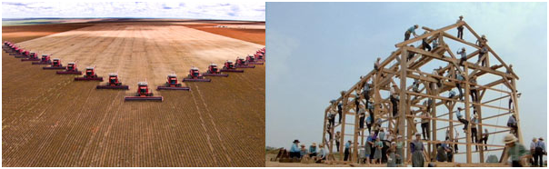

## Abstract

This presentation will cover some of the basic concepts and historical background for cluster computing.

Let me share some of my personal motivations for preparing this talk. I like to say that I was a data scientist before the term "data science" was even invented, but if truth be told, many of the data science tools that I used in the 1980s and 1990s are completely obsolete. Perhaps the data science tool that is used most often today is cluster computing or some variant of cluster computing.

I have not yet had the need for cluster computing, but I did want to learn the technology. The two ways most commonly suggested for learning cluster computing are to simulate a cluster on a single computer or to buy time on a cluster computer out in the cloud.

I disliked both of these ideas because they were largely opaque. I might be able to get the software that runs on a cluster working, but I wouldn't really understand how it works.

So I bought three Raspberry Pi computers, an Ethernet switch, and a dog bone case and decided to build my own cluster. This is hardly an original idea of mine, but I still want to work on it, both for my own benefit, but then to use as a teaching tool for others who might also want to learn cluster computing.

## What is a computer cluster?

The description found on Wikpedia is a pretty good one.

"A computer cluster is a set of loosely or tightly connected computers that work together so that, in many respects, they can be viewed as a single system. Unlike grid computers, computer clusters have each node set to perform the same task, controlled and scheduled by software."

My term, "cluster computing" means "running programs on a computer cluster." I like to use that term because it places the emphasis on the software side of things, and I've always been more of a software person than a hardware person.

But this particular talk will emphasize what a computer cluster is and why it helps.

`r readLines("../images/wikipedia_definition.txt")`

## Why would you want to use a computer cluster?

A cluster computer offers several advantages:

* high availability

* load balancing

* scalability

* modularity

* parallel processing

There are lots of reasons to use a computer cluster. In the next few slides, we'll outline four of them.

## High availability

Take notice of the number of components that appear multiple times in this picture of a computer cluster. With a bit of care, you can set up this system so that if one component within a computer cluster fails, the others components take over the work. In most systems, you can even swap in a new component for the one that fails without having to take the entire cluster down.

Has anyone in the audience actually seen a cluster computer? What does it look like? Has anyone actually performed maintenance on a cluster computer?

`r readLines("../images/working_on_cluster.txt")`

## Load balancing

A cluster computer that receives and processes multiple requests for data can send the tasks to the components that are least busy. This is like multiple lanes on a road where you find the lane that is most open.

Load balancing is very important for websites that get a lot of traffic. A computer cluster devoted to serving web pages is known as a web farm.

`r readLines("../images/multilane_road.txt")`

## Scalability

You can easily scale up a computer cluster to handle bigger problems. Notice the empty spots in this computer rack. You would just buy another computer component (typically a computer CPU or a storage drive), pop it into the rack, and hook up a few cables, download some software onto the component, and you're ready to go.

`r readLines("../images/rack_computers.txt")`

## Modularity

The flip side of scalability is that the components of a cluster computer do not need to be terribly expensive. Each component is only carrying a fraction of the total load, so it does not have to be the biggest or fastest on the block.

Here is a quote from a historical review of some of the software systems that were developed for computer clusters. 

"How Google handled disk failure. When Google was still in its early days they faced the problem of hard disk failure in their data centers. Since their core business was (and still is) “data”, they easily justified a decision to gradually replace their failing low-cost disks with more expensive, top of the line ones. As the company rose exponentially, so did the overall number of disks, and soon, they counted hard drives in millions. The decision yielded a longer disk life, when you consider each drive by itself, but in a pool of hardware that large it was still inevitable that disks fail, almost by the hour. That meant that they still had to deal with the exact same problem, so they gradually reverted back to regular, commodity hard drives and instead decided to solve the problem by considering component failure not as exception, but as a regular occurrence."

## Parallel processing

The advantage that I am most interested in is the ability of a computer cluster to process tasks in parallel. These images of a row of threshers harvesting a wheat field and a large group of workers at a barn raising illustrate the benefit of splitting a large task into small pieces that are run simultaneously. 

This is the computer equivalent of the old phrase "Many hands make light work" which can be traced all the way back to the early 1300s, according to dictionary.com.

`r readLines("../images/parallel_analogies.txt")`

## Parallel computing and statistics

Some of the most fundamental statistical summaries in statistics are easily split into small pieces.

$\bar X = \frac{1}{n} \Sigma X_i = \frac{1}{n} (\Sigma_1 X_i + \Sigma_2 X_i + ...+\Sigma_k X_i)$

In Statistics, you often see the Greek letter Sigma in various formulas. Anywhere you see a Sigma, you have an opportunity to take advantage of parallel computing. Note that counting fits into this framework nicely. It is simply the sum of X's where the X's are either 0 or 1.

## Parallel computing and simulation

](../images/stan_simulation.png)

Simulation is another big area where parallel computing can help. This image shows an illustration Hamiltonian Monte Carlo, a simulation technique quite useful for Bayesian models.

`r readLines("../images/stan_simulation.txt")`

## Conclusion

This talk has covered

* What a computer cluster is.

* Why it helps.

In summary, a computer cluster is a set of individual computers that are linked together to work as a single unit.

A cluster computer has five advantages: high availability, load balancing, scalability, modularity, and parallel processing.

