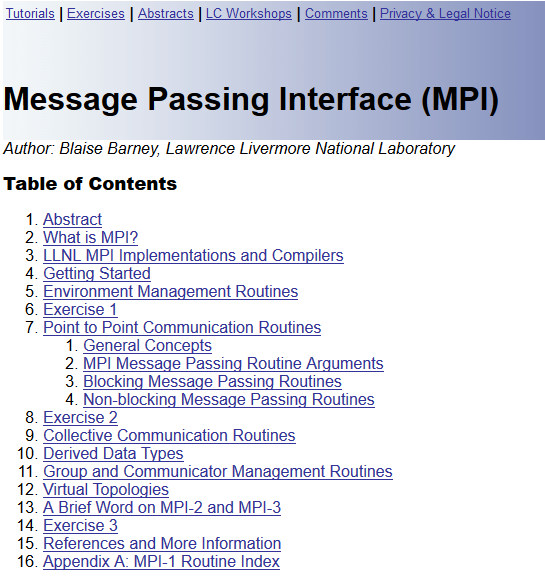
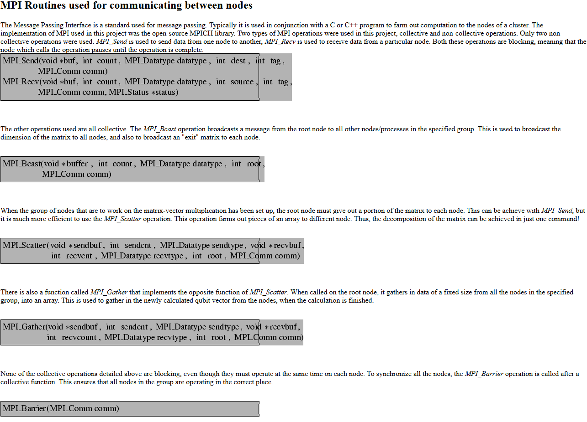
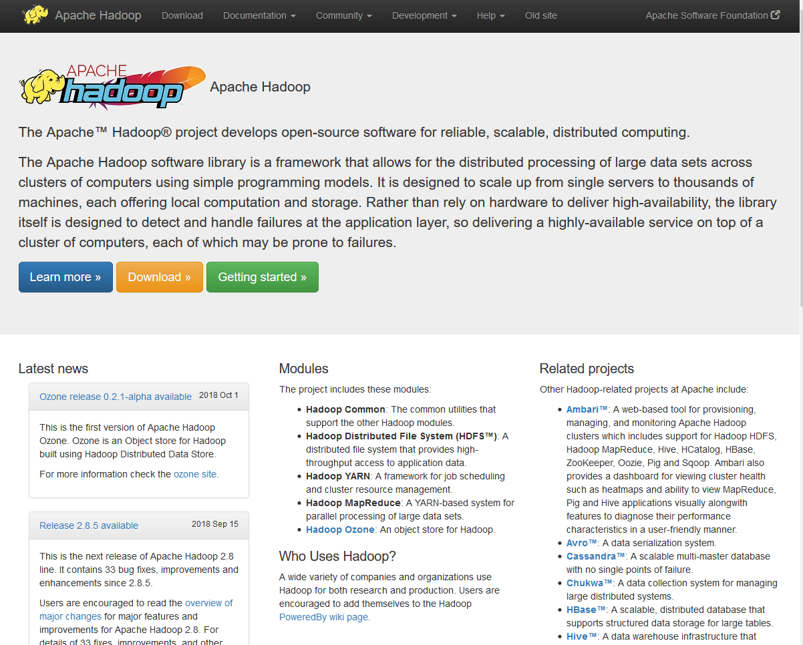
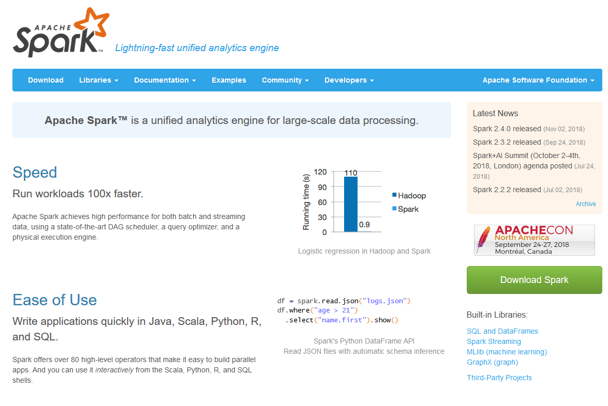

## Abstract

This presentation will cover some of the software systems for cluster computing with an emphasis on R libraries that can work with these systems.

There is a wide range of software systems for cluster computing. I wanted to provide a brief overview of these systems and some historical background to motivate why these systems were originally developed.

I am very interested in feedback from all of you. Have I summarized these software systems well? Are there other systems for cluster computing that I have neglected?

## Common features of software systems for cluster computing

All of software systems described in this presentation are

* distributed under open source licenses,

* have lots of free documentation, and

* run on any reasonable Unix based system.

The nice thing about cluster computing is that the software used on computer clusters is easy to obtain and used. It uses liberal open source licenses. It has lots of high quality documentation and tutorials, most of which are free. These software systems run easily on any reasonable Unix based system including Raspbian, the system used commonly on the Raspberry Pi computer.

They also have, for the most part, versions for other operating systems like Windows. But if you are interested in learning about cluster computing, you are much better off if you learn it on a Unix-based system.

## Message Passing Interface (MPI)

The oldest system for cluster computing, MPI, is still in use today. MPI stands for Message Passing Interface.

`r readLines("../images/mpi_tutorial.txt")`

## MPI is a routine library

MPI is a collection of subroutines that you can call from old school programming languages like C++, or Fortran. But you can also run MPI in Python.

`r readLines("../images/mpi_routines.txt")`

## Hadoop

Hadoop is a foundational tool upon which a large number of other cluster computing tools rely.

`r readLines("../images/apache_hadoop.txt")`

## Components of Hadoop

* MapReduce

* Hadoop Distributed File System (HDFS) 

* Hive

* Pig

## MapReduce

Mapreduce is system for sending pieces of a programming problem to individual nodes of a cluster computer (the map part), having those nodes produce a summary (the reduce part), and then recombining the individual node summaries.

Although Mapreduce is at the heart and soul of Hadoop, it was originally developed by Google prior to the development of Hadoop. The term "mapreduce" has become a generic term for the algorithmic process.

`r readLines("../images/mapreduce_illustration.txt")`

## Hadoop Distributed File System (HDFS) 

`r readLines("../images/hdfs_architecture.txt")`

## Pig

## Hive

## Spark

`r readLines("../images/apache_spark.txt")`

## Conclusion

This talk has covered

* Message Passing Interface

* Hadoop

  + MapReduce
  
  + HDFS
  
  + Pig
  
  + Hive

* Spark

In summary, ...

